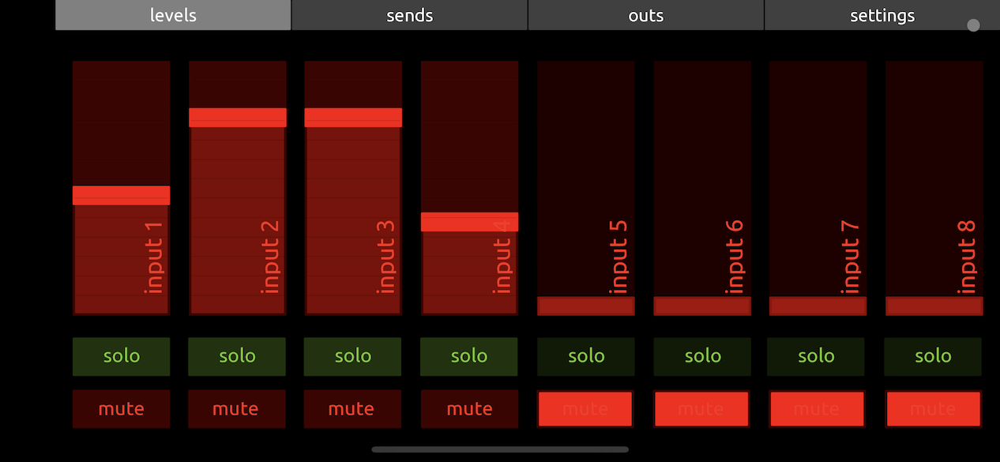
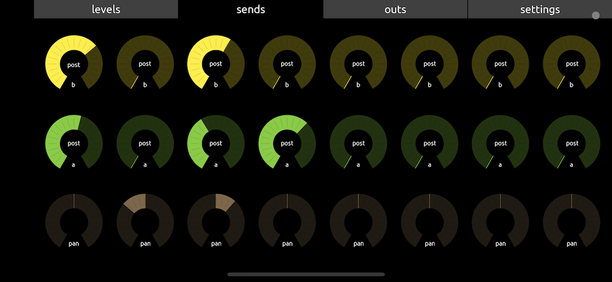
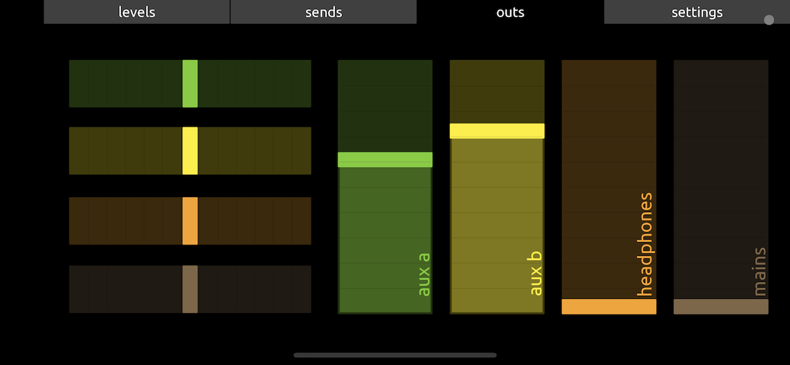
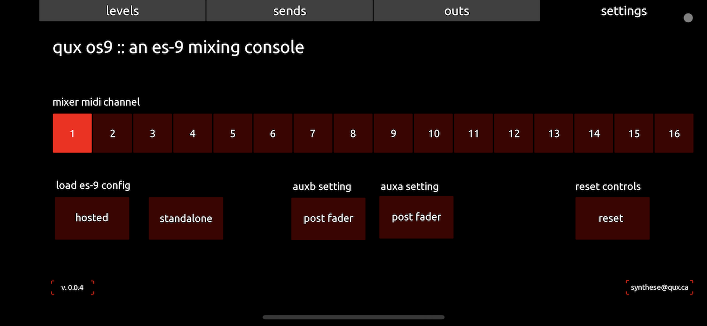
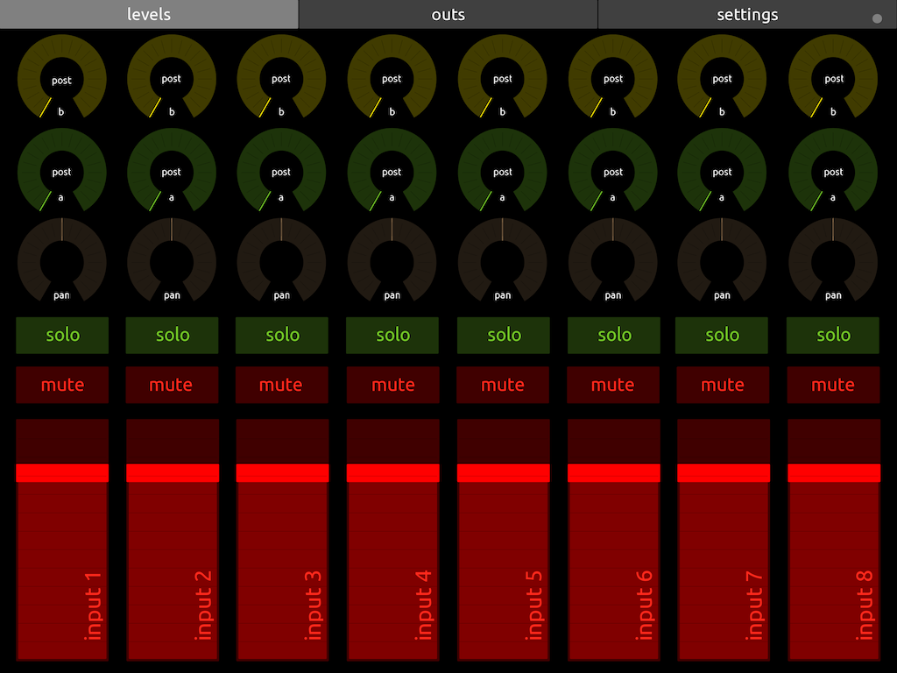

# OS9 - an 8x2 mixer interface for the ES-9 Eurorack Audio Interface

This project contains two [TouchOSC](https://hexler.net/touchosc) templates designed to use with the [Expert Sleepers ES-9 Eurorack audio interface](https://expert-sleepers.co.uk/es9.html) as a standalone 8x2 mixer with 2 sends that can be  either pre- or post-faders.

This projects is based on the ES-9 mixer configuration posted by *mr_karlos* in a [Modwiggler.com thread](https://modwiggler.com/forum/viewtopic.php?p=3464816#p3464816) about using the ES-9 for summing signals (thanks!)

## Getting Started

Before using these templates, you will need to load the `config.syx` file into your ES-9 using the ES-9 Configurator app. This file configures the ES-9 to work with the templates.

To use the templates, you will also need to have the TouchOSC app installed on your phone or tablet. You will also need to have the Expert Sleepers ES-9 Eurorack audio interface connected to your device.

For an Apple device, you will need a [Lightning to USB Camera Adapter](https://www.apple.com/shop/product/MD821AM/A/lightning-to-usb-camera-adapter).

For an Android device, you'll need an [USB On-The-Go (OTG) cable](https://en.wikipedia.org/wiki/USB_On-The-Go)

Once you have the app and interface set up, you can load the appropriate template onto your device and start using it to control your ES-9 as a standalone mixer.

## Templates

The project includes two templates:

- `os9-phone.mk2.touchosc`: This template is designed for use on a phone-sized device.
- `os9-tablet.mk2.touchosc`: This template is designed for use on a tablet-sized device.

Both templates include controls for each of the ES-9's 8 inputs and 2 sends, as well as faders for adjusting the levels of each channel. The templates also include options for selecting pre- or post-fader sends. Channels can be muted or soloed.

Inputs 1 to 8 on the ES-9 are the input channels.

Outputs 1 and 2 are the mono sends.

Inputs 11-12 and 13-14 are the stereo returns.

## Screenshots

Here are some screenshots of the templates.

## TODO

- Low pass and high pass filters  EQ.

- Directly send the content of `config.syx` to the ES-9 from the app.

## Contributing

Since TouchOSC files cannot be merged via a diff tool, please indicate what changes you did if you open a pull request.

## Licence

[CC BY-SA 4.0](https://creativecommons.org/licenses/by-sa/4.0/)
